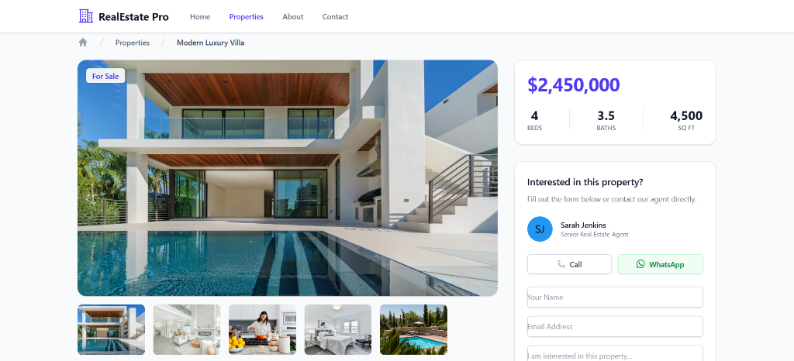
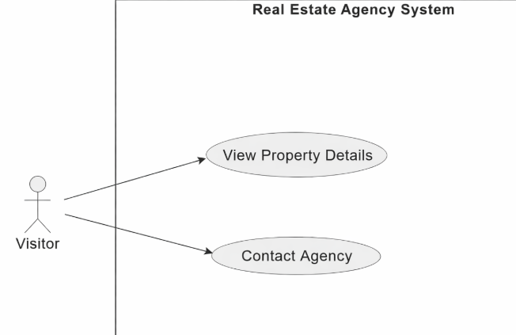
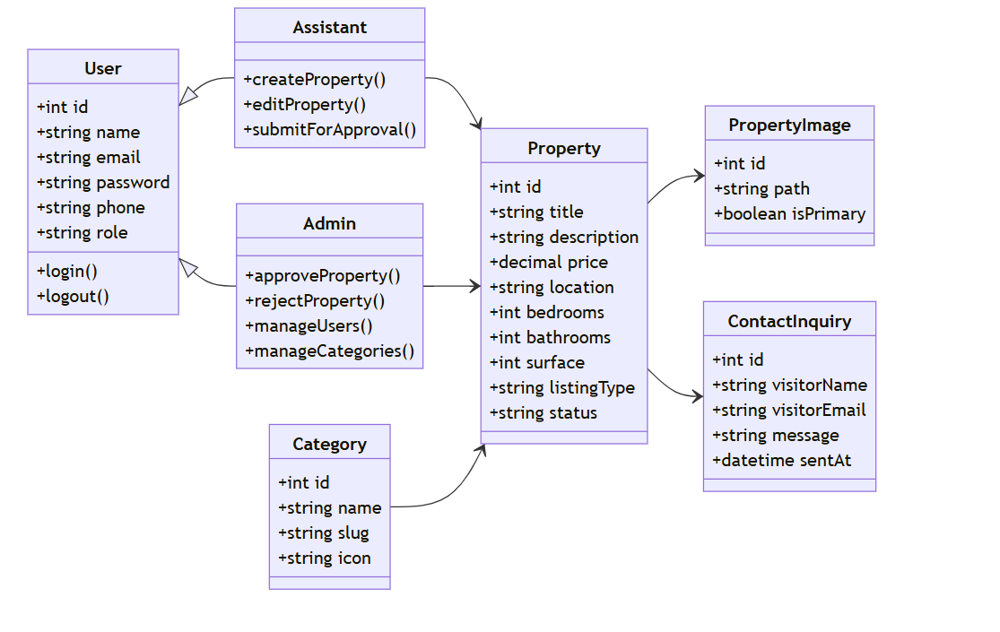

# 🏠 RealEstate Pro - Système d'Annonces Immobilières
## 🚀 Sprint 1 : Visiteur & Découverte

  
<strong>Réalisé par :</strong> Ayoub JALYTA

  
<strong>Encadré par :</strong> M. ESSARRAJ Fouad

---

###  Introduction et Contexte Général
Le projet **RealEstate Pro** est une plateforme web moderne conçue pour la gestion professionnelle d'annonces immobilières. Elle permet de centraliser les offres, d'assurer la qualité des données et de faciliter la mise en relation entre agents et acquéreurs.

**La problématique :**
La gestion manuelle ou via des réseaux sociaux manque de rigueur (validation des données), de recherche avancée (filtres précis) et de suivi efficace des demandes de contact.

**La solution :**
Un système robuste avec un workflow d'approbation administrateur, une recherche multicritères intuitive et une interface responsive pour une expérience utilisateur premium.

---

### Analyse des Besoins
1.  **Gestion de Qualité :** Toutes les annonces doivent être approuvées par un admin avant publication.
2.  **Accessibilité Publique :** Recherche avancée (Prix, Ville, Type de bien, Chambres).
3.  **Conversion client :** Formulaires de contact directs liés aux propriétés spécifiques.
4.  **Rôles & Sécurité :** Distinction claire entre Admin (supervision), Assistant (création) et Visiteur (consultation).

---

###  Méthodologies Employées

####  Méthode Scrum
Structure en sprints de 2 semaines pour ce projet :
*   **Sprint 1 :** Portail Public & Recherche.

  

#### Méthode  Recherche & Inspiration
Analyse de plateformes existantes :
*   **PropertyFinder**
*   **Avito Immobilier**
*   **Leboncoin Immobilier**

**Objectif :** Adopter les meilleures pratiques UX/UI tout en gardant une solution simple et efficace.
---

### Détails du Sprint 1 : Portail Web Public
Ce premier sprint se concentre sur l'expérience du visiteur anonyme (le futur acquéreur).

**Fonctionnalités clés :**
*   **Moteur de Recherche :** Filtrage par prix, localisation et type de bien.
*   **Galerie de Propriétés :** Affichage optimisé des annonces actives.
*   **Page de Détails :** Vue immersive avec photos haute résolution et caractéristiques techniques.
*   **Inquiry System :** Formulaire "Contactez-nous à propos de ce bien".

---

###  Travail Réalisé
**Focus Principal : Développement du Portail Public**
*   **Réalisation de la Page "Property Details" :** Développement complet de la fiche produit intégrant :
    *   Galerie d'images immersive.
    *   Grille d'informations techniques (info-grid).
    *   Composants de contact (contact-card) et Breadcrumb.

####   Lab
*   **Laravel Deployment**.

####   Maquettes et Tests Utilisateurs
*   **Maquette clé :** Page `Property_details` avec UX moderne.
*   **Outils :** Tailwind CSS

  
   
  <em>Maquette de la Page Détails des Propriétés</em>

---

###  Fonctionnalités de la Page Détails
Le flux utilisateur suit le diagramme de cas d'utilisation conçu pour ce sprint :
*   **Acteurs :** Visiteur / Public.

  
   
  <em>Diagramme de Cas d'Utilisation - Sprint 1</em>

#### Diagramme de Classes
Structure de la base de données et relations entre les entités :

  
   
  <em>Diagramme de Classes - Architecture Base de Données</em>

**Fonctionnalités Détaillées :**
*   **Galerie d'Images :** Affichage immersif des photos haute résolution.
*   **Grille d'Informations :** Récupération dynamique des données (Prix, Surface, Équipements).
*   **Formulaire de Contact :** Contactez le vendeur à propos du bien.
*   **Navigation Intuitive :** Fil d'ariane pour un retour fluide à la liste des biens.

---

### Réalisation Technique Approfondie

#### Back-End et Architecture
**Framework :** Laravel 12.

**Architecture N-Tiers :**
*   **Controller :** Requêtes HTTP.
*   **Model :** Base de données.

**Avantages :** Scalabilité, testabilité.

#### Réalisation Technique (suite)

**Front-End**
*   **Blade :** Templates réutilisables (components, layouts).
*   **Tailwind CSS :** Développement rapide, responsive.
*   **Preline UI :** Composants intégrés.
*   **Lucide :** Icones.

**Gestion de Projet**
*   **GitHub :** Versionning, branches.

---

### Conclusion

Le Sprint 1 de **RealEstate Pro** a établi les fondations solides d'une plateforme immobilière moderne et performante. Avec une architecture N-Tiers robuste, une interface utilisateur responsive et intuitive, et une gestion efficace du cycle de vie des annonces, le système répond aux besoins identifiés et offre une expérience utilisateur premium.

**Résultats clés :**
*   ✅ Page "Property Details" complète et fonctionnelle.
*   ✅ Architecture backend scalable et maintenable.
*   ✅ Interface frontend moderne avec Tailwind CSS et Preline UI.
*   ✅ Formulaire de contact intégré pour les demandes d'information.

Les prochains sprints pourront s'appuyer sur cette base solide pour ajouter des fonctionnalités avancées (panel administrateur, système de paiement, notifications) et optimiser les performances.

---

  
<em>© 2025 - RealEstate Pro - Sprint 1</em>

